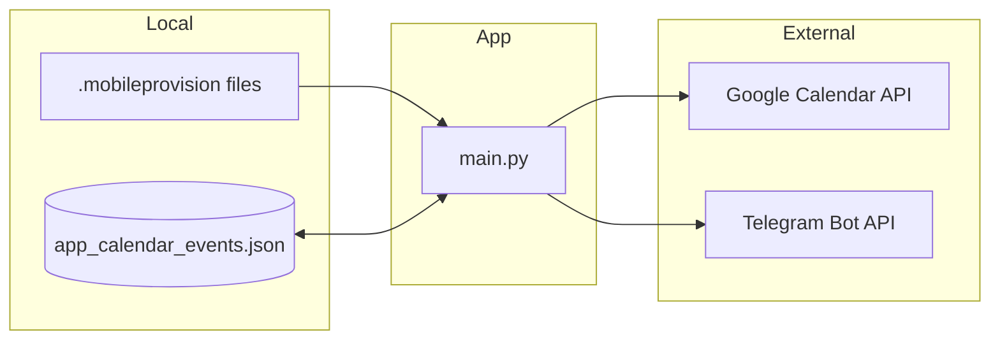

# Certificate Expiration Tracker

Monitors iOS provisioning profile expiration dates and sends notifications via Google Calendar and Telegram.

## Tech Stack

- **Language**: Python 3.12+
- **Libraries**: `rich` (console output), `google-api-python-client` (Calendar API), `requests` (Telegram API)
- **External Services**: Google Calendar API, Telegram Bot API

## Architecture



## Prerequisites

- Python 3.12+
- Xcode installed (provisioning profiles in `~/Library/Developer/Xcode/UserData/Provisioning Profiles/`)
- Google Cloud service account with Calendar API enabled
- Telegram bot token and chat ID

## Installation

1. Clone the repository:
   ```bash
   git clone https://github.com/momonala/certificate_expiration.git
   cd certificate_expiration
   ```

2. Install dependencies:
   ```bash
   pip install -e .
   ```

3. Create `google_application_credentials.json` with your Google Cloud service account credentials:
   ```json
   {
     "type": "service_account",
     "project_id": "YOUR_PROJECT_ID",
     "private_key_id": "...",
     "private_key": "...",
     "client_email": "...@...iam.gserviceaccount.com",
     "client_id": "...",
     "auth_uri": "https://accounts.google.com/o/oauth2/auth",
     "token_uri": "https://oauth2.googleapis.com/token"
   }
   ```

4. Create `values.py` with your Telegram credentials:
   ```python
   telegram_api_token = "YOUR_BOT_TOKEN"
   telegram_chat_id = "YOUR_CHAT_ID"
   ```

5. Update the certificate path in `main.py` to match your username:
   ```python
   certs = glob("/Users/YOUR_USERNAME/Library/Developer/Xcode/UserData/Provisioning Profiles/*mobileprovision")
   ```

6. Update `CALENDAR_ID` in `gcal.py` to your Google Calendar email.

## Running

```bash
python main.py
```

## Project Structure

```
certificate_expiration/
├── main.py                              # Entry point - parses certs, sends notifications
├── gcal.py                              # Google Calendar event creation/updates
├── values.py                            # Telegram credentials (not committed)
├── google_application_credentials.json  # GCP service account (not committed)
├── app_calendar_events.json             # Persisted mapping of app → calendar event ID
└── pyproject.toml                       # Project config and dependencies
```

## Key Concepts

| Concept | Description |
|---------|-------------|
| Provisioning Profile | `.mobileprovision` file containing iOS app signing certificate with expiration date |
| `XC mnalavadi` identifier | Prefix used in provisioning profiles to identify the app name |
| Event tracking | Maps app names to Google Calendar event IDs for updates vs creates |
| Day-before reminder | Calendar events are created for 1 day before actual expiration |

## Data Flow

1. **Parse** - Read `.mobileprovision` files from Xcode directory
2. **Extract** - Parse XML-like content to get app name and expiration date
3. **Filter** - Skip apps with "test" or "widget" in name
4. **Calendar** - Create/update Google Calendar event for day before expiration
5. **Notify** - Send Telegram message with expiration countdown

## Storage

| File | Purpose |
|------|---------|
| `app_calendar_events.json` | Maps app names to Google Calendar event IDs for idempotent updates |
| `google_application_credentials.json` | GCP service account credentials |
| `values.py` | Telegram bot token and chat ID |

## Configuration

| Location | Setting | Description |
|----------|---------|-------------|
| `main.py` | `certs` glob path | Path to provisioning profiles directory |
| `main.py` | `BERLIN_TZ` | Timezone for date display |
| `main.py` | `identifier` | Provisioning profile name prefix to match |
| `gcal.py` | `CALENDAR_ID` | Google Calendar to add events to |
| `gcal.py` | `colorId` | Calendar event color (11 = red) |

## External API Dependencies

| Service | Auth Method | Notes |
|---------|-------------|-------|
| Google Calendar API | Service account JSON | Requires calendar sharing with service account email |
| Telegram Bot API | Bot token | Send messages to specific chat ID |
